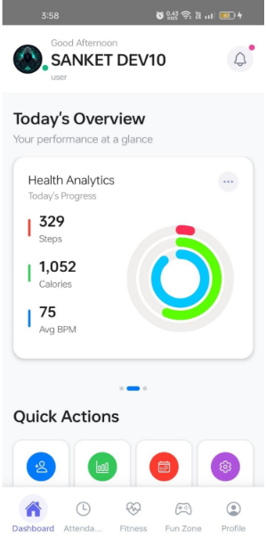
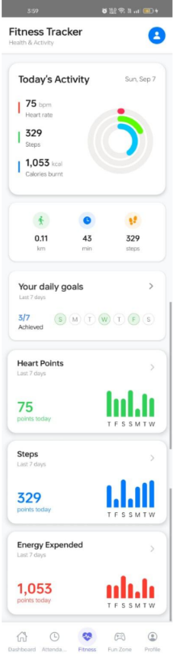

# ReteamNow — Employee Engagement App

<div align="center">

[](https://www.typescriptlang.org/)
[](https://reactnative.dev/)
[](https://metrobundler.dev/)
[](CONTRIBUTING.md)

**Connect. Collaborate. Thrive.** — A cross-platform mobile application designed to boost employee engagement through attendance tracking, health & fitness integration, team competitions, and social features.

</div>

---

## 📋 Table of Contents

- [Overview](#-overview)
- [Features](#-features)
- [Architecture](#-architecture)
- [Tech Stack](#-tech-stack)
- [Folder Structure](#-folder-structure)
- [Installation](#-installation)
- [Environment Variables](#-environment-variables)
- [Running Locally](#-running-locally)
- [Screenshots](#-screenshots) <!-- - [Demo](#-demo) -->
- [API Reference](#-api-reference)
- [Future Improvements](#-future-improvements)
- [Lessons Learned](#-lessons-learned)

---

## 🚀 Overview

ReteamNow is a **React Native** mobile application that helps organizations foster a connected, healthy, and engaged workforce. It integrates attendance management, health tracking via Google Health Connect, team competitions ("Fun Zone"), announcements, and real-time team chat — all in one polished, professionally designed interface.

---

## ✨ Features

### 📊 Dashboard & Attendance
- Real-time attendance check-in/check-out with backend validation
- Monthly attendance analytics with streak tracking
- Swipeable card-based UI for quick data insights

### ❤️ Health & Fitness
- Integration with **Google Health Connect** (Steps, Heart Rate, Calories, Distance)
- Animated progress rings for daily fitness goals
- Detail screens for each health metric with historical charts

### 🎮 Fun Zone — Competitions & Social
- Create and join team competitions with photo/video posts
- Like, comment, and share posts
- View competition leaderboards and galleries

### 📢 Announcements & Communication
- Company-wide announcements with read/unread tracking
- **ReteamChat** — Slack-inspired team messaging channels
- Role-based admin panel for content moderation

### 👤 User Management
- Multi-step registration with validation
- Profile view and editing
- Role-based access control (Admin/Employee)

---

## 🏗 Architecture

```
┌──────────────────────────────────────────────────┐
│                   App.tsx                         │
│         (SafeAreaProvider + Navigation)           │
└──────────────────┬───────────────────────────────┘
                   │
    ┌──────────────┴──────────────┐
    ▼                             ▼
┌──────────────┐          ┌──────────────┐
│  Auth Stack  │          │  App Stack   │
│ (Login/Reg)  │          │ (Drawer Nav) │
└──────────────┘          └──────┬───────┘
                                 │
                    ┌────────────┴────────────┐
                    ▼                         ▼
           ┌─────────────────┐       ┌─────────────────┐
           │   Bottom Tabs   │       │  Drawer Screens │
           │ (Dashboard,     │       │ (Settings,       │
           │  Attendance,    │       │  Announcements,  │
           │  Fitness,       │       │  Admin Panel,    │
           │  FunZone,       │       │  ReteamChat)     │
           │  Profile)       │       │                  │
           └────────┬────────┘       └─────────────────┘
                    │
     ┌──────────────┼──────────────┐
     ▼              ▼              ▼
┌──────────┐ ┌──────────┐ ┌──────────────┐
│ Home     │ │Attendance│ │ Health Stack │
│ (Pager)  │ │ (Tabs)   │ │ (Details)    │
└──────────┘ └──────────┘ └──────────────┘
```

### Design Decisions

- **Context-based State Management**: Auth and health state are managed via React Context to avoid prop drilling while keeping the architecture simple.
- **Drawer + Bottom Tab Hybrid**: The drawer provides access to secondary screens (Announcements, Admin, Chat) while bottom tabs handle primary navigation.
- **Health Connect Integration**: Direct integration with Android's Health Connect API for real-time fitness data without a middleman server.
- **Animated Onboarding**: Smooth animated onboarding screens using React Native's `Animated` API to create a premium first-run experience.

### Trade-offs

| Decision | Trade-off |
|----------|-----------|
| React Context vs Redux | Simpler setup, but may cause unnecessary re-renders at scale |
| Direct API calls in services | Less abstraction, but simpler to debug |
| Inline styles with StyleSheet | No CSS-in-JS runtime cost, but less dynamic styling |
| PagerView for dashboard cards | Great UX on mobile, but limited customization |

---

## 🛠 Tech Stack

| Technology | Purpose |
|------------|---------|
| **React Native 0.80** | Cross-platform mobile framework |
| **TypeScript 5.0** | Type-safe development |
| **React Navigation 7** | Navigation (Stack, Drawer, Bottom Tabs) |
| **Axios** | HTTP client for REST API calls |
| **react-native-health-connect** | Google Health Connect integration |
| **react-native-reanimated** | Smooth animations |
| **react-native-vector-icons** | Icon library (Ionicons) |
| **react-native-linear-gradient** | Gradient backgrounds |
| **react-native-bootsplash** | Splash screen animation |
| **react-native-toast-message** | In-app notifications |
| **react-native-gifted-charts** | Health metric charts |
| **AsyncStorage** | Local persistence for auth tokens |

### Backend Server

| Technology | Purpose |
|------------|---------|
| **Node.js / Express** | REST API server |
| **MongoDB / Mongoose** | Database & ODM |
| **Socket.IO** | Real-time communication (chat, notifications) |
| **JWT** | Authentication & authorization |
| **Node-Cron** | Scheduled tasks & automation |
| **Nodemailer** | Email notifications |
| **Google Gemini AI** | AI-powered chatbot features |

---

## 📁 Folder Structure

```
Reteamnow-app/
├── android/               # Android native configuration
├── ios/                   # iOS native configuration
├── backend/               # REST API server (Express + MongoDB)
│   ├── config/            # Server configuration
│   ├── constants/         # Enums & constants
│   ├── controllers/       # Route handlers
│   ├── errors/            # Custom error classes
│   ├── middlewares/        # Express middlewares
│   ├── models/            # Mongoose schemas
│   ├── routes/            # API route definitions
│   ├── scripts/           # Utility scripts
│   ├── service/           # Business logic layer
│   ├── utils/             # Shared utilities
│   ├── uploads/           # File uploads directory
│   ├── app.js             # Express app setup
│   ├── index.js           # Server entry point
│   └── package.json
├── assets/                # Static assets
│   ├── bootsplash/        # Boot splash screen assets
│   ├── screenshots/       # App screenshots (add your own)
│   ├── banner.png         # Repository banner placeholder
│   ├── logo.png           # Project logo placeholder
│   └── demo.gif           # Demo GIF placeholder
├── src/
│   ├── components/        # Reusable UI components
│   │   ├── ImagePicker.tsx
│   │   ├── LoginIllustration.tsx
│   │   ├── ProgressRings.tsx
│   │   └── RegisterIllustration.tsx
│   ├── config/            # App configuration
│   │   ├── api.ts         # API config
│   │   ├── colors.ts      # Color palette
│   │   ├── theme.ts       # Theme tokens (spacing, shadows, commonStyles)
│   │   └── typography.ts  # Typography scale
│   ├── context/           # React Context providers
│   │   ├── authContext.tsx
│   │   └── healthContext.tsx
│   ├── navigation/        # Navigation configuration
│   │   ├── RootNavigator.tsx
│   │   ├── AppStack.tsx
│   │   ├── AuthStack.tsx
│   │   ├── BottomTabs.tsx
│   │   ├── HealthStack.tsx
│   │   ├── FunZoneStack.tsx
│   │   └── SettingsStack.tsx
│   ├── screens/           # Screen components
│   │   ├── AuthScreens/          # Login, Register
│   │   ├── DrawerScreens/        # Admin, Announcements, Chat
│   │   ├── FunZoneScreens/       # Competitions, Posts
│   │   ├── HealthTrackScreens/   # Health metric details
│   │   ├── OnboardingScreens/    # Welcome flow
│   │   ├── SettingsScreens/      # Profile, Edit Profile
│   │   └── TabScreens/           # Home, Attendance, Fitness, etc.
│   ├── services/          # API service layer
│   │   ├── announcementService.ts
│   │   ├── attendanceService.ts
│   │   ├── authService.ts
│   │   ├── eventService.ts
│   │   └── healthConnectService.ts
│   ├── types/             # TypeScript type declarations
│   │   └── env.d.ts
│   └── utils/             # Shared utilities
│       └── asyncStorage.ts
├── App.tsx                # Application entry point
├── index.js               # React Native entry point
├── package.json
├── tsconfig.json
└── ...
```

---

## 📦 Installation

### Prerequisites

- **Node.js** >= 18
- **npm** or **yarn**
- **React Native CLI** set up (see [React Native Environment Setup](https://reactnative.dev/docs/environment-setup))
- **Android Studio** (for Android development)
- **Xcode** (for iOS development, macOS only)

### Step 1: Clone the Repository

```bash
git clone https://github.com/your-username/reteamnow-app.git
cd Reteamnow-app
```

### Step 2: Install Dependencies

```bash
npm install
```

### Step 3: Install iOS Pods (iOS only)

```bash
cd ios && pod install && cd ..
```

### Step 4: Configure Environment Variables

```bash
cp .env.example .env
```

Edit `.env` with your backend API base URL (see [Environment Variables](#environment-variables)).

### Step 5: Install Backend Dependencies

```bash
npm run backend:install
# or
cd backend && npm install
```

### Step 6: Configure Backend Environment

```bash
cp backend/.env.example backend/.env
# Edit backend/.env with your database URI, JWT secret, and API keys
```

---

## 🔐 Environment Variables

The app uses `react-native-dotenv` to manage environment configuration.

| Variable | Description | Required | Default |
|----------|-------------|----------|---------|
| `API_BASE_URL` | Backend API base URL | **Yes** | `http://localhost:8062/api` |

Create a `.env` file in the project root:

```env
API_BASE_URL=http://your-backend-server.com/api
```

> ⚠️ **Never commit `.env` to version control.** The `.gitignore` already excludes it.

### Backend Environment Variables

| Variable | Description | Required |
|----------|-------------|----------|
| `MONGO_URI` | MongoDB connection URI | **Yes** |
| `MONGODB_NAME` | MongoDB database name | **Yes** |
| `JWT_SECRET` | Secret key for JWT signing | **Yes** |
| `PORT` | Server port | No (default: 8017) |
| `CLIENT_URL` | Frontend client origin for CORS | **Yes** |
| `GEMINI_API_KEY` | Google Gemini AI API key | For AI features |
| `OPENAI_API_KEY` | OpenAI API key | For AI features |
| `EMAIL_USER` / `EMAIL_PASS` | SMTP credentials | For email features |

---

## 🎯 Running Locally

### Start Metro Bundler

```bash
npm start
```

### Run on Android

```bash
npm run android
```

### Run on iOS

```bash
npm run ios
```

### Run Tests

```bash
npm test
```

### Lint Code

```bash
npm run lint
```

### Run Backend Server

```bash
# Development mode (with auto-reload)
npm run backend:dev

# Production mode (via PM2)
npm run backend:start
```

The backend API will be available at `http://localhost:8017`.

---

## 📸 Screenshots

<div align="center">
  
  
</div>

---
<!-- ## 🎥 Demo

[Insert Demo Video]

--- -->

## 📡 API Reference

The app communicates with a RESTful backend API at the configured `API_BASE_URL`. Below are the main endpoints used:

### Authentication
| Method | Endpoint | Description |
|--------|----------|-------------|
| POST | `/auth/login` | User login |
| POST | `/user/create-user` | User registration |

### Attendance
| Method | Endpoint | Description |
|--------|----------|-------------|
| POST | `/attendance/checkin` | Check in |
| POST | `/attendance/checkout` | Check out |
| GET | `/attendance/today/:userId` | Today's status |
| GET | `/attendance/history/:userId` | Attendance history |

### Announcements
| Method | Endpoint | Description |
|--------|----------|-------------|
| GET | `/announcements` | List announcements |
| PATCH | `/announcements/:id/like` | Like an announcement |
| PATCH | `/announcements/:id/mark-read` | Mark as read |

### Events & Competitions
| Method | Endpoint | Description |
|--------|----------|-------------|
| GET | `/event/competitions` | List competitions |
| GET | `/event/competitions/:id` | Competition details |
| GET | `/event/competitions/:id/posts` | Competition posts |
| POST | `/event/competitions/:id/posts` | Create post |
| POST | `/event/posts/:id/react` | React to post |
| POST | `/event/posts/:id/comments` | Add comment |

---

## 🔮 Future Improvements

- [ ] **Offline Support**: Implement offline-first architecture using WatermelonDB or Realm
- [ ] **Push Notifications**: Integrate Firebase Cloud Messaging for real-time alerts
- [ ] **Dark Mode**: Full dark theme support using the existing color system
- [ ] **i18n**: Multi-language support for international teams
- [ ] **CI/CD Pipeline**: GitHub Actions for automated testing and builds
- [ ] **E2E Testing**: Detox or Maestro for end-to-end tests
- [ ] **Performance**: Implement FlashList for large lists, code-splitting
- [ ] **Security**: Certificate pinning, biometric authentication
- [ ] **Analytics**: Integrate with Firebase Analytics or Mixpanel
- [ ] **Accessibility**: Full VoiceOver/TalkBack support

---

## 📚 Lessons Learned

1. **Health Connect API requires careful permission handling** — The Android Health Connect SDK needs explicit runtime permissions, and the app must handle cases where the user denies or revokes them.
2. **React Context vs State Management Libraries** — For a mid-sized app like this, React Context with hooks is sufficient and avoids the boilerplate of Redux or Zustand. However, for larger teams or more complex state, a dedicated solution would be better.
3. **Onboarding Animation Performance** — Using `useNativeDriver: true` and `Animated.spring` for the onboarding screens required careful orchestration to avoid jank. Memoizing components with `useMemo` and `useCallback` is essential.
4. **Navigation Architecture** — Combining drawer + bottom tab navigation is powerful but requires careful planning to avoid nested navigator issues. Keeping a flat navigation structure where possible simplifies the codebase.

---

<div align="center">
Thank you for checking out ReteamNow!
</div>
